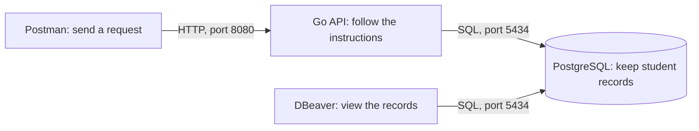

# Student register: learning Go through a real task

Imagine you work at a school's front desk. You need to find a student's details and register a new student. These lessons make your Go API do those jobs using a database.

Start with [lesson 6: set up the database](docs/06-start-the-database.md).

| Lesson | What you will be able to do | Suggested time |
| --- | --- | --- |
| [6. Start the database](docs/06-start-the-database.md) | Start PostgreSQL with a student table and two sample students. | 30–45 minutes |
| [7. Explore with DBeaver](docs/07-explore-with-dbeaver.md) | Open the table, find a student, and read a small SQL instruction. | 30–45 minutes |
| [8. Find a student through Go](docs/08-find-a-student.md) | Make `GET /student?studentId=0231` return a saved student. | Two 30–45 minute sessions |
| [9. Register a student through Go](docs/09-register-a-student.md) | Make `POST /student` save a student and return the saved details. | 45–60 minutes |

These are suggested session lengths. Continue when the learner can explain the result in their own words.

## Before teaching

Steps 1–5 are assumed to have introduced GET, POST, Postman, query strings, and reading JSON into a Go struct. In this checkout, `server/main.go` only prints `hello`; the earlier HTTP examples are not present. The worked examples use **Gin**, an assumed choice based on the earlier JSON-binding lesson. If your earlier code uses another library, the database and SQL lessons still apply, but the HTTP code will need adapting.

Lesson 8 includes a complete GET example so this checkout has a usable starting point. Lesson 9 builds on it. The finished [reference file](docs/reference/main.go.txt) is an answer sheet for the teacher. Read each small section with the learner before using the complete answer.

Have Docker Desktop running, DBeaver Community installed, Postman available, and Go working before the lesson. Downloading software can be a separate preparation session. This project's `server/go.mod` requests Go `1.26.7`; run `go version` **inside `server`** before teaching and allow any required toolchain download to finish.

The examples use three fields: `studentId`, `name`, and `email`. If your earlier lessons use different fields, agree on one set before starting. All names and addresses here are fictional. The connection details are public practice values for a database on this computer.

## Use the registration page

[web-app/index.html](web-app/index.html) contains a registration form and a student ID lookup. It uses the lesson API directly, sending `POST /student` to register and `GET /student?studentId=...` to find a record. Student IDs stay as text, including any starting zeros.

After completing lessons 8–9, start the database with `docker compose up -d --wait` from the project's top folder. In another terminal, run `go run .` from **server**, then open **http://127.0.0.1:8080/** in your browser. Keep both the database and Go server running. For example, find sample student `0231`, or register `0233` and find that ID afterward.

The lesson and reference code include this line just after `router := gin.Default()`:

```go
router.StaticFile("/", "../web-app/index.html")
```

If you are using your own Gin API, add that line to your existing router and restart Go from **server**. Open the address above instead of double-clicking the HTML file: Go serves the page and API from the same address, so the browser can use both without additional cross-origin settings. This checkout's original `server/main.go` is still the learner's starting point; the working API is built in the lessons, with the complete answer in [docs/reference/main.go.txt](docs/reference/main.go.txt).

## The picture to keep in mind



The reply travels back along the same path. PostgreSQL runs inside Docker. Go, Postman, and DBeaver run on your computer. DBeaver and the Go API access the same database independently; the API can work while DBeaver is closed.

## How to run each lesson

Use the same cycle: **predict → try → observe → explain**.

1. Describe one school-office task in everyday language.
2. Ask the learner what they expect to happen.
3. Let them type or change one small part and run it.
4. Compare what happened with their prediction.
5. Ask them to explain it without reading the code aloud.

For example: “If I close Postman, will the saved student disappear? How could we check?” Let the learner test the answer.

Introduce words when they become useful. A **database** keeps records; a **table** is like one spreadsheet sheet; a **row** holds one student; a **column** holds one kind of information. **SQL** is the language used to ask the database to read or change records.

For the first pass, focus on the path from request to saved record. The teacher can supply the connection setup and error-handling code, then explain those lines gradually. Keep the Go code in one file for these lessons.

Finish by having the learner register a fictional student, find that student in Postman and DBeaver, and explain why the record survives restarting the API.
