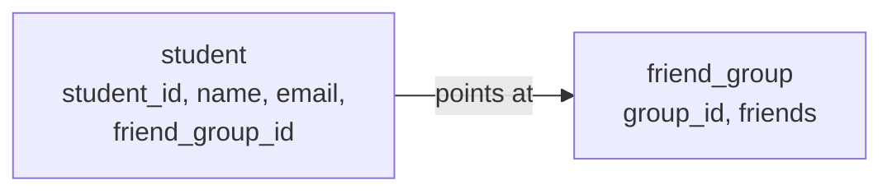

# 10. Give every student a place to keep friends

**Today's result:** every student in your database has a friends list, and the list is empty.

Last week the front desk could register a student and find one. This week the office asks a new question: *"who are this student's friends?"* Before Go can answer it, the database needs somewhere to keep the answer.

You will not write any Go today. Today is a database day, like lesson 7.

## The shape we are adding



Every student owns **one** friends list. Mali's row points at Mali's list; Arun's row points at Arun's list. The list itself is a column that holds several student IDs at once.

| Word | Everyday meaning |
| --- | --- |
| `friend_group` | A table with one row per student's friends list. |
| `group_id` | The name of one list, for example `g-0231` for Mali's list. |
| `friends` | The IDs of the friends on that list, kept together in one column. |
| `friend_group_id` | The column on `student` that says which list belongs to this student. |
| **foreign key** | A promise that this column's value must exist in another table. |

A column that holds several values at once is called an **array**. Postgres writes an array of text as `TEXT[]`.

## 1. Start the database

From the project's top folder:

```sh
docker compose up -d --wait
```

Open DBeaver and connect to `student_register`, exactly as in lesson 7.

## 2. Read the change before you run it

Open [database/migrations/002-add-friend-group.sql](../../database/migrations/002-add-friend-group.sql). Read it with your teacher before running anything. It has five steps:

| Step | What it does |
| --- | --- |
| 1 | Creates the `friend_group` table. |
| 2 | Adds the `friend_group_id` column to `student`, pointing at `friend_group`. |
| 3 | Adds two more students, so there are people to be friends with. |
| 4 | Gives every student who already exists an empty list. This is called a **backfill**. |
| 5 | Checks the backfill worked. |

**Predict first.** Your database already contains Mali, Arun, and any student you registered yourself in lesson 9. After step 4, how many rows will `friend_group` have? Write your guess down before continuing.

## 3. Run it, one statement at a time

In DBeaver, open a SQL editor on `student_register`. Copy **one statement at a time** from the file, run it, and read the message at the bottom.

Start with step 1:

```sql
CREATE TABLE friend_group (
    group_id TEXT PRIMARY KEY,
    friends  TEXT[] NOT NULL DEFAULT '{}'
);
```

| Part | Meaning |
| --- | --- |
| `TEXT[]` | This column holds a list of text values, not just one. |
| `NOT NULL` | The column must always have a value. |
| `DEFAULT '{}'` | A new list starts empty. `{}` is how Postgres writes an empty array. |

Then step 2:

```sql
ALTER TABLE student
    ADD COLUMN friend_group_id TEXT REFERENCES friend_group (group_id);
```

`ALTER TABLE` changes a table that already exists and already has records in it. `REFERENCES friend_group (group_id)` is the foreign key: Postgres will now refuse to put a list name in this column unless that list really exists. Try it and see:

```sql
UPDATE student SET friend_group_id = 'not-a-real-list' WHERE student_id = '0231';
```

Expected: an error mentioning a **foreign key constraint**. The database protected itself. Nothing was changed.

Run steps 3, 4 and 5. Step 5 must return `0`.

## 4. Look at what you made

```sql
SELECT s.student_id, s.name, s.friend_group_id, g.friends
FROM student s
JOIN friend_group g ON g.group_id = s.friend_group_id
ORDER BY s.student_id;
```

`JOIN` is the word for reading two tables together: *for each student, also fetch the matching row from `friend_group`*. You will use it a lot from now on.

Expected: one row per student, every `friends` column showing `{}`.

Compare this with your prediction from step 2.

## 5. The awkward question

The backfill you just ran gave a list to Mali, Arun, and to any student **you** invented in lesson 9. Nobody knew those IDs when this file was written. The backfill did not need to know them either: it said *"every student who does not have a list yet"* rather than naming anyone.

Now open [database/init/01-students.sql](../../database/init/01-students.sql). That file also creates the `student` table — but it did not create `friend_group`. Two files now describe the same database.

**Checkpoint:** A teammate installs this project tomorrow on a brand new laptop. The `init` folder runs, and they get the `student` table with no `friend_group`. You have `friend_group` and they do not, but you both have the same project files. Why is that dangerous, and what would you have to remember to tell them?

There is no perfect answer yet. Read [database/migrations/README.md](../../database/migrations/README.md) together for how this project handles it for now. Real teams use a tool that runs the migration files automatically and remembers which ones it has already run. That is week 03.

**Checkpoint:** explain, without reading the SQL aloud, what a foreign key promised you in step 3.

Next: [11. Show and add friends](11-show-and-add-friends.md).
