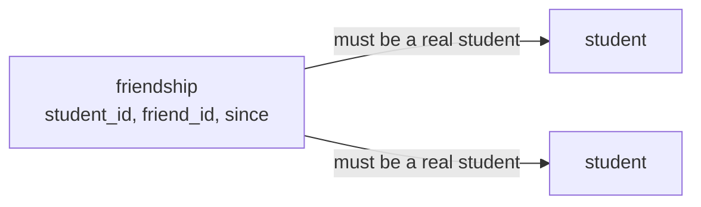

# 12. "When did they become friends?"

**Today's result:** you can explain why a list of IDs cannot answer the office's new question, and you have built the table that can.

Split this into two sittings:

* **Sitting A** — the new request, and why the current design cannot hold the answer.
* **Sitting B** — design and create the new table.

**Read this first.** Today you replace something you built two lessons ago, and it worked. That is not a sign you built it wrong. The office asked for a friends list and you delivered a friends list. Today the office asks for something *more*, and a design that was right for the old question is not right for the new one. Noticing that early, and changing it on purpose, is one of the most valuable things a backend engineer does. Code that is never replaced is usually code nobody uses.

---

## Sitting A

### 1. The request

> *From the school office:* the students want to see how long they have been friends. On the friends list, please show the date each friendship started.

**Predict first.** Look at your two tables. Where would you put that date? Take five minutes and try to find a place for it before reading on.

```text
friend_group
  group_id  |  friends
  g-0231    |  {0232}
  g-0232    |  {0231, 0234}
```

There is no room. The array holds student IDs and nothing else. An array element is a single value; it cannot carry a second value alongside it.

You could try keeping a second array of dates, lined up so that position 1 matches position 1. Ask yourself what happens the first time someone removes a friend from one array and forgets the other.

### 2. The deeper problem

The date is what the office asked for. It is not the only thing this design cannot do. Try these in DBeaver.

**A friend who does not exist.** Put a made-up ID into a real list:

```sql
UPDATE friend_group SET friends = array_append(friends, '9999') WHERE group_id = 'g-0235';
```

It works. There is no student `9999`. Now look at Nida's friends:

```sql
SELECT friend.student_id, friend.name
FROM student me
JOIN friend_group list ON list.group_id = me.friend_group_id
JOIN student friend ON friend.student_id = ANY (list.friends)
WHERE me.student_id = '0235';
```

No rows. The database is holding a friendship with a person who does not exist, and quietly showing nothing. Nobody is told. Nothing is broken loudly. This is called a **ghost**.

Your Go code in lesson 11 checks for this before writing. But your Go code is not the only thing that will ever touch this database — you just wrote to it yourself, from DBeaver, in one line. Applications also have bugs. A rule that only lives in the application is a rule that will be broken eventually.

In lesson 10, the foreign key on `friend_group_id` refused a made-up value instantly. Postgres cannot make that same promise about a value *inside* an array.

**Who lists Mali as a friend?** Try to ask that question. You cannot start from Mali; you have to look inside every list in the table and see whether `0231` is in it. With five students that is instant. With fifty thousand it is not.

Leave the ghost in place. You will meet it again in lesson 13.

### 3. What all three problems have in common

| Problem | Cause |
| --- | --- |
| No room for a date | A friendship is not a *thing* in our database. It is a value hidden inside a column. |
| Ghost friends | Postgres can only make promises about columns, not about values inside an array. |
| Slow reverse lookup | The only way in is through the student who owns the list. |

A friendship connects two students, it has its own facts (a date), and it should be findable from either end. In a database, something like that needs to be **its own row in its own table**.

**Checkpoint:** explain to your teacher why "the office wants a date" and "a ghost friend is possible" are really the same problem wearing two hats.

---

## Sitting B

### 4. The new shape



One friendship, one row. Mali and Arun being friends becomes two rows — `0231 → 0232` and `0232 → 0231` — written together, exactly as the two arrays were updated together in lesson 11.

**Predict first:** we could store just one row per pair and look both ways when reading. Which would you choose, and what would the reading query have to do?

We choose two rows. Listing a student's friends then stays the simple question it is today: *find the rows where `student_id` is me.*

### 5. Read the table before creating it

Open [database/migrations/003-friendship.sql](../../database/migrations/003-friendship.sql) and read statement 1 together:

```sql
CREATE TABLE friendship (
    student_id TEXT NOT NULL REFERENCES student (student_id),
    friend_id  TEXT NOT NULL REFERENCES student (student_id),
    since      DATE,
    PRIMARY KEY (student_id, friend_id),
    CHECK (student_id <> friend_id)
);
```

| Part | Meaning |
| --- | --- |
| `REFERENCES student (student_id)` | A foreign key on **both** columns. A ghost is now impossible. |
| `since DATE` | The date the office asked for. It has a home. |
| `PRIMARY KEY (student_id, friend_id)` | The pair together identifies the row, so the same friendship cannot be stored twice. |
| `CHECK (student_id <> friend_id)` | Nobody can be their own friend. `<>` means "is not equal to". |

Three rules that lived in your Go code in lesson 11 — real students only, no duplicates, nobody is their own friend — now also live in the database. Your Go checks stay, because they produce a friendly message instead of an error. But if your Go code ever gets them wrong, the database still refuses.

Run statement 1 in DBeaver.

### 6. Test the promises by trying to break them

```sql
INSERT INTO friendship (student_id, friend_id) VALUES ('0231', '9999');
INSERT INTO friendship (student_id, friend_id) VALUES ('0231', '0231');
INSERT INTO friendship (student_id, friend_id, since) VALUES ('0231', '0232', '2026-01-15');
INSERT INTO friendship (student_id, friend_id, since) VALUES ('0231', '0232', '2026-02-01');
```

Expected, in order: foreign key error, check error, success, duplicate key error. Read each error message out loud. These are the messages you will spend a career reading.

Clean up the one that worked, so lesson 13 starts from an empty table:

```sql
DELETE FROM friendship;
```

**Checkpoint:** the table is created and empty. `friend_group` still holds all the real friendships, and your API still reads from it. Nothing is broken; the new table simply is not used yet.

That in-between state is normal. Changes this size are made in small steps that each leave the system working.

Next: [13. Move the friendships across](13-move-the-friendships-across.md).
