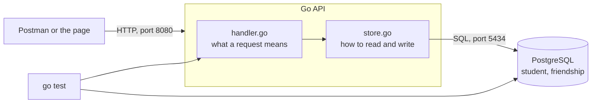

# Week 02 — From a friends list to a friends table

**The week in one sentence:** you build a friends feature on a design that works, the school office asks one more question, and you change the design to answer it.

Start with [lesson 10](10-give-students-a-friends-list.md).

| Lesson | What you will be able to do | Suggested time |
| --- | --- | --- |
| [10. Give every student a friends list](10-give-students-a-friends-list.md) | Add a table and a column to a database that already holds records, and backfill every student. | 45–60 minutes |
| [11. Show and add friends](11-show-and-add-friends.md) | Make `GET /friends?studentId=0232` list a student's friends, and `POST /friend` make two students friends both ways. | Two 45–60 minute sessions |
| [12. "When did they become friends?"](12-when-did-they-become-friends.md) | Explain why a list of IDs cannot hold a date, and build the table that can. | Two 45–60 minute sessions |
| [13. Move the friendships across](13-move-the-friendships-across.md) | Move real records into a new design without losing any, then delete the old one. | 45–60 minutes |
| [14. One big file is hard to read](14-one-big-file.md) | Split one long file into three that each do one job, and take the password out of the code. | 45–60 minutes |
| [15. Prove it still works tomorrow](15-prove-it-still-works.md) | Run `go test ./...` and have the computer check the whole feature for you. | 45–60 minutes |

Roughly eight sittings. Lessons 11 and 12 carry the most new ideas and are meant to be split.

## What is new this week

| Idea | Lesson | In everyday words |
| --- | --- | --- |
| Foreign key | 10 | A promise that this value exists in another table. |
| Migration | 10, 13 | A small, ordered, readable change to a database that already holds records. |
| Backfill | 10 | Giving records that already exist whatever the new design needs. |
| `JOIN` | 11 | Reading two tables together in one question. |
| Transaction | 11 | Several writes that all happen or none do. |
| `NULL` | 13 | "We do not know", which is not the same as empty. |
| Refactoring | 14 | Changing the shape of code without changing what it does. |
| Unit test | 15 | Checking one small function on its own. |
| Integration test | 15 | Checking several parts working together, against the real database. |

## Before teaching

Week 02 assumes week 01 is finished: a working `GET /student` and `POST /student` against PostgreSQL in Docker, Postman, and DBeaver. If the learner's `server/main.go` is not in that state, start from [week 01's answer sheet](../week01/reference/main.go.txt).

The new database steps are in [database/migrations/](../../database/migrations/). Read [migrations/README.md](../../database/migrations/README.md) yourself before lesson 10, because the learner will ask why the same database is described in two places — that question is the point of lesson 10's last checkpoint.

The [answer sheets](reference/README.md) hold the code at the end of lessons 11, 13 and 15. The learner should write each piece first.

The two page handouts in [handouts/](handouts/) are copied over `web-app/index.html` in lessons 11 and 13. The learner never writes the page; they make the API behind it work.

## The tone that matters most

Lesson 12 replaces a design the learner built two lessons earlier and got right. Say so out loud, more than once: **the design was correct for the question that had been asked, and the question changed.** A learner who reads lesson 12 as "I did it wrong" takes the wrong lesson from the best week in the course.

Keep using week 01's cycle: **predict → try → observe → explain**. The lessons are written with the predictions built in; do not skip them, especially the ones where the prediction is meant to be wrong.

## The picture by the end of the week

Back to the [course index](../../README.md). Week 01 is [here](../week01/README.md).
